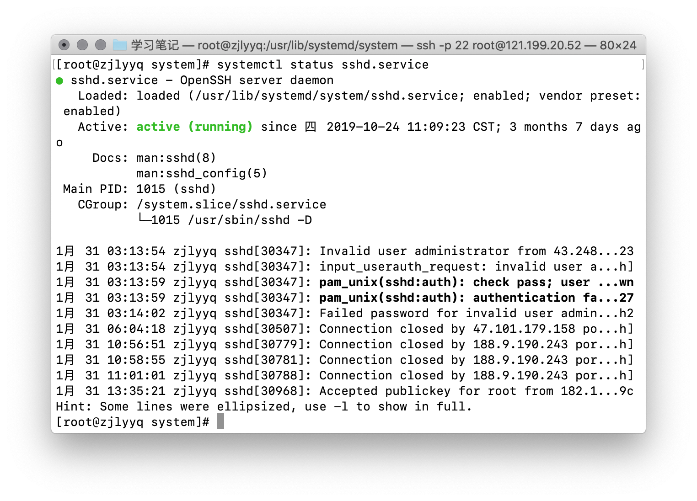

<div style="text-align:center;">
  <h1>
    Linux学习笔记
  </h1>
  
</div>

## 系统管理

### 服务管理工具

#### service和systemctl

##### centos7之前

服务由service控制。服务脚本存放在`/etc/init.d`目录下。

```shell
[root@host init.d]# ls
acpid             crond      halt          httpd      iscsi    lvm2-lvmetad  multipathd  network  qemukvmga    rsyslog    single
auditd            functions  haveged       ip6tables  iscsid   lvm2-monitor  netconsole  postfix  rdisc        sandbox    sshd
blk-availability  gwarp      htcacheclean  iptables   killall  mdmonitor     netfs       qemu-ga  restorecond  saslauthd  udev-post
[root@host init.d]# 
```


```shell
[root@host ~]# cat chkconfig.txt 
CHKCONFIG(8)                                                      CHKCONFIG(8)

NAME
       chkconfig  -  updates  and queries runlevel information for system ser-
       vices


SYNOPSIS
       chkconfig [--list] [--type type][name]
       chkconfig --add name
       chkconfig --del name
       chkconfig --override name
       chkconfig [--level levels] [--type type] name <on|off|reset|resetprior-
       ities>
       chkconfig [--level levels] [--type type] name


DESCRIPTION
       chkconfig  provides  a  simple  command-line  tool  for maintaining the
       /etc/rc[0-6].d directory hierarchy(等级) by relieving(减轻)  system  administrators
       of  the  task  of  directly manipulating（操纵） the numerous symbolic links(符号链接) in
       those directories.

       This implementation of chkconfig was inspired by the chkconfig  command
       present  in the IRIX operating system. Rather than maintaining configu-
       ration information outside of the  /etc/rc[0-6].d  hierarchy,  however,
       this  version  directly  manages  the  symlinks in /etc/rc[0-6].d. This
       leaves all of the configuration  information  regarding(有关)  what  services
       init starts in a single location.

       chkconfig  has five distinct functions: adding new services for manage-
       ment, removing services from management, listing  the  current  startup
       information  for  services,  changing  the startup information for ser-
       vices, and checking the startup state of a particular service.

       When chkconfig is run with only a service name, it checks to see if the
       service  is configured to be started in the current runlevel. If it is,
       chkconfig returns true; otherwise it returns false. The --level  option
       may be used to have chkconfig query an alternative runlevel rather than
       the current one.

       When chkconfig is run with the --list argument, or no arguments at all,
       a listing is displayed of all services and their current configuration.

       If one of on, off, reset, or resetpriorities  is  specified  after  the
       service  name, chkconfig changes the startup information for the speci-
       fied service.  The on and off flags cause the service to be started  or
       stopped,  respectively,  in the runlevels being changed. The reset flag
       resets the on/off state for all runlevels for the service  to  whatever
       is  specified in the init script in question, while the resetpriorities
       flag resets the start/stop priorities for the service  to  whatever  is
       specifed in the init script.

       By  default,  the on and off options affect only runlevels 2, 3, 4, and
       5, while reset and resetpriorities affects all of the  runlevels.   The
       --level option may be used to specify which runlevels are affected.

       Note that for every service, each runlevel has either a start script or
       a stop script.  When switching runlevels, init  will  not  re-start  an
       already-started  service,  and  will  not re-stop a service that is not
       running.

       chkconfig also can manage xinetd scripts via the means of xinetd.d con-
       figuration  files.  Note that only the on, off, and --list commands are
       supported for xinetd.d services.

       chkconfig supports a --type argument to limit actions to  only  a  spe-
       cific  type  of services, in the case where services of either type may
       share a name. Possible values for type are sysv and xinetd.


OPTIONS
       --level levels
              Specifies the run levels an operation should pertain to.  It  is
              given  as  a string of numbers from 0 to 6. For example, --level
              35 specifies runlevels 3 and 5.


       --add name

              This option adds a new  service  for  management  by  chkconfig.
              When  a new service is added, chkconfig ensures that the service
              has either a start or a kill entry in  every  runlevel.  If  any
              runlevel  is missing such an entry, chkconfig creates the appro-
              priate entry as specified by the  default  values  in  the  init
              script.  Note  that default entries in LSB-delimited ’INIT INFO’
              sections take precedence  over  the  default  runlevels  in  the
              initscript;  if  any Required-Start or Required-Stop entries are
              present, the start and stop priorities of  the  script  will  be
              adjusted to account for these dependencies.


       --del name
              The  service  is removed from chkconfig management, and any sym-
              bolic links in /etc/rc[0-6].d which pertain to it are removed.

              Note that future package installs for this service may run  chk-
              config  --add,  which  will re-add such links. To disable a ser-
              vice, run chkconfig name off.


       --override name
              If service name is configured exactly as  it  would  be  if  the
              --add  option  had  been  specified  with  no  override  file in
              /etc/chkconfig.d/name, and if /etc/chkconfig.d/name  now  exists
              and  is  specified  differently from the base initscript, change
              the configuration for  service  name  to  follow  the  overrides
              instead of the base configuration.


       --list name
              This  option  lists  all  of  the services which chkconfig knows
              about, and whether they are stopped or started in each runlevel.
              If  name is specified, information in only display about service
              name.


RUNLEVEL FILES
       Each service which should be manageable by chkconfig needs two or  more
       commented  lines  added to its init.d script. The first line tells chk-
       config what runlevels the service should be started in by  default,  as
       well  as the start and stop priority levels. If the service should not,
       by default, be started in any runlevels, a - should be used in place of
       the  runlevels  list.   The  second line contains a description for the
       service, and may be extended across multiple lines with backslash  con-
       tinuation.

       For example, random.init has these three lines:
       # chkconfig: 2345 20 80
       # description: Saves and restores system entropy pool for \
       #              higher quality random number generation.
       This  says  that the random script should be started in levels 2, 3, 4,
       and 5, that its start priority should be 20, and that its stop priority
       should  be  80.   You should be able to figure out what the description
       says; the \ causes the line to be continued.  The extra space in  front
       of the line is ignored.

       chkconfig  also supports LSB-style init stanzas, and will apply them in
       preference to "chkconfig:" lines where available.  A LSB  stanza  looks
       like:
       ### BEGIN INIT INFO
       # Provides: foo
       # Required-Start: bar
       # Defalt-Start: 2 3 4 5
       # Default-Stop: 0 1 6
       # Description: Foo init script
       ### END INIT INFO

       In this case, the start priority of "foo" would be changed such that it
       is higher than the "bar" start priority, if  "bar"  is  enabled.   Care
       must  be  taken when adding dependencies, as they can cause vast shifts
       in the start and stop priorities of many scripts.


OVERRIDE FILES
       File in /etc/chkconfig.d/servicename are parsed using the same comments
       that  chkconfig notices in init service scripts, and override values in
       the init service scripts themselves.


SEE ALSO
       init(8) ntsysv(8) system-config-services(8)


AUTHOR
       Erik Troan <ewt@redhat.com>


4th Berkeley Distribution       Wed Oct 8 1997                    CHKCONFIG(8)
[root@host ~]# 
```


在centos7之前的系统上，服务由service管理。通过运行`chkconfig --list`命令可以查看所有服务在不同运行级别（0~6）的开关状态。

<div style="text-align:center;">
  
  <p>
    （查看所有服务在不同运行级别（0~6）的开关状态）
  </p>
  
  <p>
    （/etc/rc[0-6].d 目录文件中都是符号链接）
  </p>
</div>

> `init`代表1号进程，具体的定义
>
> 不同数字代表的运行级别：0——关机模式，1——单用户模式，2——不带网络的多用户模式，3——字符终端模式，4——暂未使用，5——图形模式，6——重启

```shell
[root@host ~]# cat init.txt 
init(8)                                                                init(8)


NAME
       init - Upstart process management daemon

SYNOPSIS
       init [OPTION]...

DESCRIPTION
       init  is  the  parent of all processes on the system, it is executed by
       the kernel and is responsible for starting all other processes;  it  is
       the  parent  of all processes whose natural parents have died and it is
       responsible for reaping those when they die.

       Processes managed by init are known as jobs and are defined by files in
       the  /etc/init  directory.  See init(5) for more details on configuring
       Upstart.

   Events
       init(8) is an event-based init daemon.  This means that  jobs  will  be
       automatically  started  and stopped by changes that occur to the system
       state, including as a result of jobs starting and stopping.

       This is different to dependency-based init daemons which start a speci-
       fied  set  of  goal jobs, and resolve the order in which they should be
       started and other jobs required by iterating their dependencies.

       For more information on starting and stopping jobs, as well as emitting
       events that will automatically start and stop jobs, see the manual page
       for the initctl(8) tool.

       The primary event is the startup(7) event, emitted when the daemon  has
       finished loading its configuration.  Other useful events are the start-
       ing(7), started(7), stopping(7) and stopped(7) events emitted  as  jobs
       change state.

   System V compatibility
       The  Upstart  init(8)  daemon  does not keep track of runlevels itself,
       instead they are implemented entirely  by  its  userspace  tools.   The
       event emitted to signify a change of runlevel is the runlevel(7) event.
       For more information see its manual page.

OPTIONS
       Options are passed to init(8) by placing them on  the  kernel  command-
       line.

       --verbose
              Outputs verbose messages about job state changes and event emis-
              sions to the system console or log, useful for debugging boot.

NOTES
       init is not normally executed by a user process, and expects to have  a
       process  id  of  1.   If this is not the case, it will actually execute
       telinit(8) and pass all arguments to that.  See that  manual  page  for
       further details.

FILES
       /etc/init.conf

       /etc/init/*.conf

AUTHOR
       Written by Scott James Remnant <scott@netsplit.com>

REPORTING BUGS
       Report bugs at <https://launchpad.net/upstart/+bugs>

COPYRIGHT
       Copyright © 2010 Canonical Ltd.
       This is free software; see the source for copying conditions.  There is
       NO warranty; not even for MERCHANTABILITY or FITNESS FOR  A  PARTICULAR
       PURPOSE.

SEE ALSO
       init(5)   initctl(8)   telinit(8)  runlevel(7)  startup(7)  starting(7)
       started(7) stopping(7) stopped(7)


Upstart                           2010-02-04                           init(8)
[root@host ~]# 

```

<div style="text-align:center;">
  <p>
    (init进程详细说明)
  </p>
</div>

> init服务的配置文件是`/etc/inittab`，这个文件主要配置了默认的运行级别。

> 在centos7之后有了一个新的服务systemd取代了init

```shell
# inittab is only used by upstart for the default runlevel.
#
# ADDING OTHER CONFIGURATION HERE WILL HAVE NO EFFECT ON YOUR SYSTEM.
#
# System initialization is started by /etc/init/rcS.conf
#
# Individual runlevels are started by /etc/init/rc.conf
#
# Ctrl-Alt-Delete is handled by /etc/init/control-alt-delete.conf
#
# Terminal gettys are handled by /etc/init/tty.conf and /etc/init/serial.conf,
# with configuration in /etc/sysconfig/init.
#
# For information on how to write upstart event handlers, or how
# upstart works, see init(5), init(8), and initctl(8).
#
# Default runlevel. The runlevels used are:
#   0 - halt (Do NOT set initdefault to this)
#   1 - Single user mode
#   2 - Multiuser, without NFS (The same as 3, if you do not have networking)
#   3 - Full multiuser mode
#   4 - unused
#   5 - X11
#   6 - reboot (Do NOT set initdefault to this)
# 
id:3:initdefault:
```

<div style="text-align:center;">
  <p>
    (/etc/inittab 文件)
  </p>
</div>

##### centos7之后

服务由systemctl控制。服务脚本存放在`/usr/lib/systemd/system/`。服务的启停通过`system stsrt/stop/restart/status`。

<div style="text-align:center;">
  
  <p>
    （查看sshd.service服务的状态）
  </p>
</div>

###### systemctl命令